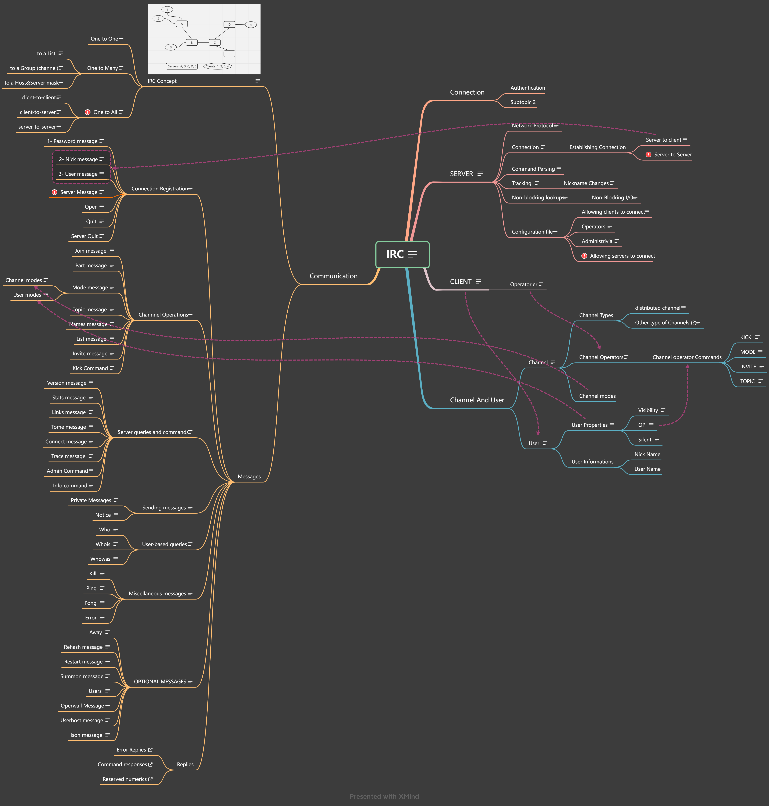
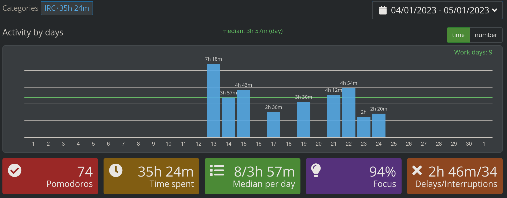

# **Bir IRC sunucusu Nasil Yapilir?**
> Bu projede kendi icerisinde calisan (Server-Server baglantisi bulunmayan) client to server baglantilarina odaklanmis bir IRC sunucusu yapmaya odaklaniyoruz.

## IRC Nedir?
* OpenAI ChatGpt:
	```
	IRC (Internet Relay Chat), internet üzerinde kullanıcıların anlık olarak yazılı mesajlar gönderip alabilecekleri, sohbet edebilecekleri bir çevrimiçi sohbet protokolüdür. 1988 yılında Finlandiya'da Jarkko Oikarinen tarafından geliştirilmiştir.

	IRC, birçok farklı sunucuda barındırılan birçok farklı sohbet kanalına bağlanabilen bir istemci/sunucu protokolüdür. Her sunucu birden fazla kanala ev sahipliği yapabilir ve her kanalda birden fazla kullanıcı sohbet edebilir.

	IRC, internetin erken dönemlerinde popülerdi ve günümüzde de hala birçok insan tarafından kullanılmaktadır. IRC'nin en büyük avantajlarından biri, özelleştirilebilirliği ve çok sayıda IRC istemcisine (örneğin mIRC, XChat, irssi) sahip olmasıdır. Ayrıca, açık kaynak kodlu olduğu için, herkesin kendi IRC sunucusunu veya istemcisini geliştirmesi mümkündür.
	```

## Genel yapi ve Gereksinimler
Oncelikle Bir irc sunucusunun barindirmasi gereken ozellikleri ele alalim.

> Projede kurulan yapilarin haritalandirilmis hali bu resimde mevcut, resmin daha detayli halini gormek istiyorsaniz veya Harita uzerindeki aciklamalara da ulasmak istiyorsaniz 'img-n-files' klasorunun icindeki "IRC-Map*" dosyalarina goz atabilirsiniz. xmind dosyasini acabilmek icin [buradaki web sitesine](https://xmind.works/) giris yapmalisiniz.

Lutfen yukaridaki Gorseli dikkatlice inceleyin. bu gorsel butun yolducul boyunca bize rehbert olacak.

bir IRC sunucusu yapmak icin bize lazim olan seyler kisaca:
 * Istemcilerin baglanti bilgilerini ve ozelliklerini tutan siniflar.
 * Istemcilerin bir araya gelebilecekleri Channellar.
 * Sunucunun ozelliklerini bulunduran, ayni zamanda butun kanallari ve istemcilerin listesini barindiran bir sunucu bir sinifi.
 * Sunucu ile Istemci arasinda haberlesme saglamak icin Mesaj templateleri.

Tabii ki bunlari yapabilmek icin c++ uzerinde siniflar, kalitim gibi ```Nesle Tabanli Progeramlama``` terimlerinin ne olduklarini ve nasil kullanildiklarini bilmeniz gerekiyor.

## Ilk once temel

Diger herseyin duzgun sekilde calisabilmesi icin iyi bir temel atmamiz gerekiyor. Bu temeli ```Server``` class'i ile atarak sunucuyu istenilen port'da calisir hale getirip o portu dinlemeye baslamamiz gerekiyor.

```cpp
#include <netinet/in.h>
#include <sys/socket.h>
//Kutuphaneleri ile erisebildigimiz:
int socket(int domain, int type, int protocol);
// Bu fonksiyon ile bir socket olusturup socket referansini File Descriptor olarak sakliyoruz.

int setsockopt(int sockfd, int level, int optname, const void *optval, socklen_t optlen);
// ile socket'in nasil bir yapida calisacagini ayarlayip

int bind(int sockfd, const struct sockaddr *addr, socklen_t addrlen);
// ile de ayarladigimiz socket'in referans aldigi filedescriptoru uzerinden programa bagliyoruz.
// normalde struct sockaddr kullanilirken ben <netinet/in.h> ile tanimlanan struct sockaddr_in yapisini kullaniyorum.

int listen(int sockfd, int backlog);
// ile socket'i dinlemeye basliyoruz.
```
Sonunda socket'i dinlemeye basladik, simdi sirada socket uzerinden gelen herhangi bir istegi yakalip o istek uzerinde islem yapmaya baslamamiz gerekiyor.

### **Loop**
Suanda Socket'i dinlemeye basladik ama socket uzerinden gelen istekleri henuz yakalayamiyoruz. Bunun icin bir dongu olusturup bu dongu uzerinde ```poll()``` fonksiyonu ile istekleri yakalamamiz gerekiyor.
//poll fonksiyonu nedir ne ise yarar ?
```cpp
while (1)
{
	int fd = poll(struct pollfd *fds, nfds_t nfds, int timeout);
	//FD controlleri
	//.
	//.
	//.
}
```
* *fds ile dinledigimiz socketlerin bagli oldugu file descriptorlarin(FD) listesini veriyoruz.
* nfds ile kac tane FD dinledigimizi veriyor
* son parametre olarakda timeout parametresi veriyoruz. -1 Verilirse sonsuza gadar istek bekliyor.

- Geri donus degeri olarak istek gelen socket'in bagli oldugu FD degerini gonderir.

Socketleri dinledigimize gore gelen istekleri anlamli hale getirelim.
* eger fd sunucu socket'i ile ayni olursa yeni bir baglanti istegi gelmis demektir. ```accept()``` komutunu kullanarak yeni gelen baglanti icin bir socket olusturup o socketi ```*fds``` listesine eklemeliyiz. **Evet sunucu dahil dinledigimiz butun socketler *fds icerisinde bulunmasi gerekiyor**
* Eger fd ile sunucu socket'i farkli ise bu sefer socket uzerinden bir mesaj gelmis demektir.
* Eger gelen mesaj bos ise veya cikis bilgisi iceriyorsa socket baglantisi koparilmali.

## Daha sonra Devam edecegim!
Bu proje temelinde cok basit bir proje aktif bir calisma ile 1 hafta - 10 gunde bitebilir.

bu gorselde proje icin ayirdigim toplam vakit grafigi bulunuyor, inceleyebilirsiniz :D.
